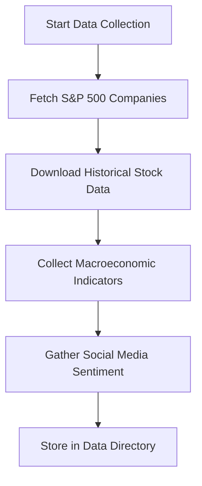

# 🤖 AI-Powered Stock Market Analysis & Prediction

[](https://www.python.org/downloads/)
[](LICENSE)
[]()

## 📌 Title & Objective

**AI-Powered Stock Market Analysis & Prediction** is a comprehensive machine learning project that leverages artificial intelligence to analyze and predict stock market movements. The project focuses on S&P 500 companies and combines multiple data sources to create robust predictive models.

### 🎯 Key Objectives:
- **Data Collection**: Gather comprehensive financial and macroeconomic data
- **Sentiment Analysis**: Analyze social media sentiment for market insights
- **Feature Engineering**: Create predictive features from multiple data sources
- **Model Development**: Build and train advanced ML models (LSTM, Transformers)
- **Prediction System**: Develop real-time stock price prediction capabilities
- **Web Interface**: Create user-friendly dashboards for analysis and predictions

---

## 📊 Datasets Used

### 📈 Financial Data Sources
- **Yahoo Finance (yfinance)**: Historical stock prices, volume, market cap, company info
- **Alpha Vantage**: Real-time stock data and technical indicators
- **S&P 500 Index**: Top 50 companies by market capitalization

### 🌍 Macroeconomic Indicators
- **World Bank API**: GDP growth, inflation, interest rates, unemployment
- **FRED (Federal Reserve)**: Economic indicators, money supply, federal funds rate
- **IMF Data**: International monetary and financial statistics

### 📱 Social Media & News
- **Twitter API**: Real-time sentiment analysis of stock-related tweets
- **News APIs**: Financial news sentiment and market impact analysis
- **Reddit**: Community sentiment from r/wallstreetbets and r/investing

### 📊 Alternative Data
- **Bloomberg Terminal**: Professional financial data (if available)
- **SEC Filings**: Company financial reports and disclosures
- **Economic Calendars**: Scheduled economic events and announcements

---

## ⚙️ Technologies and Tools

### 🐍 Core Technologies
- **Python 3.8+**: Primary programming language
- **Jupyter Notebooks**: Interactive data analysis and model development
- **Git**: Version control and collaboration

### 📊 Data Processing & Analysis
- **Pandas**: Data manipulation and analysis
- **NumPy**: Numerical computing
- **yfinance**: Yahoo Finance data extraction
- **requests**: HTTP library for API calls
- **BeautifulSoup**: Web scraping capabilities

### 🤖 Machine Learning & AI
- **Scikit-learn**: Traditional ML algorithms (Random Forest, XGBoost, SVM)
- **TensorFlow/Keras**: Deep learning models and neural networks
- **LSTM Networks**: Time series prediction and sequence modeling
- **Transformers**: Advanced NLP models for sentiment analysis
- **Prophet**: Facebook's time series forecasting tool

### 📈 Data Visualization
- **Matplotlib**: Basic plotting and visualization
- **Seaborn**: Statistical data visualization
- **Plotly**: Interactive charts and dashboards
- **Streamlit**: Web application framework for data apps

### 🌐 Web Development
- **Flask**: Backend web framework
- **Streamlit**: Rapid web app development
- **HTML/CSS/JavaScript**: Frontend development
- **Docker**: Containerization for deployment

### 📊 Database & Storage
- **SQLite/PostgreSQL**: Data storage and management
- **CSV/JSON**: Data file formats
- **Pickle**: Model serialization

---

## 🔁 Project Workflow

### 1. 📥 Data Collection Phase


### 2. 🧹 Data Preprocessing
- **Data Cleaning**: Handle missing values, outliers, and inconsistencies
- **Feature Engineering**: Create technical indicators, sentiment scores
- **Data Normalization**: Scale features for ML models
- **Time Series Alignment**: Synchronize different data sources

### 3. 🔍 Exploratory Data Analysis (EDA)
- **Statistical Analysis**: Correlation matrices, distribution plots
- **Time Series Analysis**: Trend analysis, seasonality detection
- **Sentiment Analysis**: Social media sentiment trends
- **Market Analysis**: Sector performance, volatility patterns

### 4. 🤖 Model Development
- **Feature Selection**: Identify most predictive features
- **Model Training**: Train multiple ML algorithms
- **Hyperparameter Tuning**: Optimize model performance
- **Cross-Validation**: Ensure model robustness

### 5. 📊 Model Evaluation
- **Performance Metrics**: RMSE, MAE, MAPE, R²
- **Backtesting**: Historical performance validation
- **Risk Analysis**: Drawdown analysis, Sharpe ratio
- **Model Comparison**: Ensemble methods and voting

### 6. 🚀 Deployment
- **Web Application**: Streamlit dashboard
- **API Development**: RESTful API for predictions
- **Real-time Updates**: Automated data refresh
- **Monitoring**: Model performance tracking

---

## 📁 Folder Structure

```
SP500-Analysis-and-Prediction/
├── 📁 data/
│   ├── 📁 raw/                    # Raw data files
│   │   ├── 📄 AAPL_historical_data.csv
│   │   ├── 📄 MSFT_historical_data.csv
│   │   └── ...                    # Other stock data files
│   ├── 📁 processed/              # Cleaned and processed data
│   │   ├── 📄 AAPL_historical_data.csv
│   │   ├── 📄 MSFT_historical_data.csv
│   │   └── ...                    # Processed stock data
│   └── 📁 macroeconomic/          # Economic indicators
│       ├── 📄 world_bank_indicators.csv
│       ├── 📄 fred_indicators.csv
│       └── 📄 combined_macroeconomic_indicators.csv
├── 📁 notebooks/                  # Jupyter notebooks
│   ├── 📄 01_data_collection.ipynb
│   ├── 📄 02_data_preprocessing.ipynb
│   ├── 📄 03_eda.ipynb
│   ├── 📄 04_feature_engineering.ipynb
│   ├── 📄 05_model_development.ipynb
│   └── 📄 06_model_evaluation.ipynb
├── 📁 src/                        # Source code
│   ├── 📁 data/                   # Data processing modules
│   │   ├── 📄 stock_data_fetcher.py
│   │   ├── 📄 macro_data_fetcher.py
│   │   └── 📄 sentiment_analyzer.py
│   ├── 📁 models/                 # ML model implementations
│   │   ├── 📄 lstm_model.py
│   │   ├── 📄 transformer_model.py
│   │   └── 📄 ensemble_model.py
│   ├── 📁 utils/                  # Utility functions
│   │   ├── 📄 data_utils.py
│   │   ├── 📄 model_utils.py
│   │   └── 📄 visualization.py
│   └── 📁 web/                    # Web application
│       ├── 📄 app.py
│       ├── 📄 dashboard.py
│       └── 📄 api.py
├── 📁 models/                     # Trained model files
│   ├── 📄 lstm_model.pkl
│   ├── 📄 transformer_model.pkl
│   └── 📄 ensemble_model.pkl
├── 📁 tests/                      # Unit tests
│   ├── 📄 test_data_fetcher.py
│   ├── 📄 test_models.py
│   └── 📄 test_utils.py
├── 📁 docs/                       # Documentation
│   ├── 📄 api_documentation.md
│   ├── 📄 model_documentation.md
│   └── 📄 deployment_guide.md
├── 📄 requirements.txt            # Python dependencies
├── 📄 README.md                   # Project documentation
├── 📄 LICENSE                     # MIT License
├── 📄 .gitignore                  # Git ignore file
└── 📄 setup.py                    # Package setup
```

---

## 🚀 How to Run the Project Locally

### Prerequisites
- Python 3.8 or higher
- Git
- pip (Python package installer)

### 1. 🏗️ Clone the Repository
```bash
git clone https://github.com/yourusername/SP500-Analysis-and-Prediction.git
cd SP500-Analysis-and-Prediction
```

### 2. 🐍 Set Up Virtual Environment
```bash
# Create virtual environment
python -m venv venv

# Activate virtual environment
# On Windows:
venv\Scripts\activate
# On macOS/Linux:
source venv/bin/activate
```

### 3. 📦 Install Dependencies
```bash
pip install -r requirements.txt
```

### 4. 🔑 Set Up API Keys (Optional)
Create a `.env` file in the root directory:
```bash
# Twitter API
TWITTER_BEARER_TOKEN=your_twitter_bearer_token

# Alpha Vantage API
ALPHA_VANTAGE_API_KEY=your_alpha_vantage_key

# FRED API
FRED_API_KEY=your_fred_api_key

# World Bank API (usually free)
WORLD_BANK_API_KEY=your_world_bank_key
```

### 5. 📊 Data Collection
```bash
# Collect stock data
python src/data/stock_data_fetcher.py

# Collect macroeconomic data
python src/data/macro_data_fetcher.py

# Collect sentiment data
python src/data/sentiment_analyzer.py
```

### 6. 🧠 Train Models
```bash
# Run Jupyter notebooks for model development
jupyter notebook notebooks/

# Or run individual scripts
python src/models/lstm_model.py
python src/models/transformer_model.py
```

### 7. 🌐 Launch Web Application
```bash
# Launch Streamlit dashboard
streamlit run src/web/dashboard.py

# Or launch Flask API
python src/web/api.py
```

### 8. 🧪 Run Tests
```bash
# Run all tests
python -m pytest tests/

# Run specific test file
python -m pytest tests/test_data_fetcher.py
```

---

## 🔮 Future Improvements

### 🚀 Short-term Enhancements (1-3 months)
- **Real-time Data Pipeline**: Implement Apache Kafka for real-time data streaming
- **Advanced Sentiment Analysis**: Integrate BERT and GPT models for better sentiment detection
- **Technical Indicators**: Add more sophisticated technical analysis indicators
- **Risk Management**: Implement portfolio optimization and risk assessment tools
- **Mobile App**: Develop React Native mobile application

### 🌟 Medium-term Goals (3-6 months)
- **Multi-asset Support**: Extend to cryptocurrencies, forex, and commodities
- **Advanced ML Models**: Implement reinforcement learning for trading strategies
- **Cloud Deployment**: Deploy on AWS/Azure with auto-scaling capabilities
- **API Marketplace**: Create public API for third-party integrations
- **Backtesting Framework**: Comprehensive historical strategy testing

### 🎯 Long-term Vision (6+ months)
- **AI Trading Bot**: Fully automated trading system with risk controls
- **Predictive Analytics Platform**: SaaS platform for institutional clients
- **Alternative Data Integration**: Satellite imagery, credit card data, weather data
- **Blockchain Integration**: Decentralized prediction markets
- **Global Market Coverage**: Support for international markets and exchanges

### 🔬 Research Areas
- **Quantum Computing**: Explore quantum algorithms for optimization
- **Federated Learning**: Privacy-preserving model training
- **Explainable AI**: Model interpretability and transparency
- **Causal Inference**: Understanding cause-effect relationships in markets

---

## 🤝 Contributing

We welcome contributions from the community! Please follow these steps:

1. **Fork** the repository
2. **Create** a feature branch (`git checkout -b feature/AmazingFeature`)
3. **Commit** your changes (`git commit -m 'Add some AmazingFeature'`)
4. **Push** to the branch (`git push origin feature/AmazingFeature`)
5. **Open** a Pull Request

### 📋 Contribution Guidelines
- Follow PEP 8 style guidelines
- Add tests for new functionality
- Update documentation as needed
- Ensure all tests pass before submitting

---

## 📜 License

This project is licensed under the MIT License - see the [LICENSE](LICENSE) file for details.

```
MIT License

Copyright (c) 2024 AI-Powered Stock Market Analysis & Prediction

Permission is hereby granted, free of charge, to any person obtaining a copy
of this software and associated documentation files (the "Software"), to deal
in the Software without restriction, including without limitation the rights
to use, copy, modify, merge, publish, distribute, sublicense, and/or sell
copies of the Software, and to permit persons to whom the Software is
furnished to do so, subject to the following conditions:

The above copyright notice and this permission notice shall be included in all
copies or substantial portions of the Software.

THE SOFTWARE IS PROVIDED "AS IS", WITHOUT WARRANTY OF ANY KIND, EXPRESS OR
IMPLIED, INCLUDING BUT NOT LIMITED TO THE WARRANTIES OF MERCHANTABILITY,
FITNESS FOR A PARTICULAR PURPOSE AND NONINFRINGEMENT. IN NO EVENT SHALL THE
AUTHORS OR COPYRIGHT HOLDERS BE LIABLE FOR ANY CLAIM, DAMAGES OR OTHER
LIABILITY, WHETHER IN AN ACTION OF CONTRACT, TORT OR OTHERWISE, ARISING FROM,
OUT OF OR IN CONNECTION WITH THE SOFTWARE OR THE USE OR OTHER DEALINGS IN THE
SOFTWARE.
```

---

## 📞 Contact & Support

- **Project Link**: [https://github.com/yourusername/SP500-Analysis-and-Prediction](https://github.com/yourusername/SP500-Analysis-and-Prediction)
- **Issues**: [GitHub Issues](https://github.com/yourusername/SP500-Analysis-and-Prediction/issues)
- **Discussions**: [GitHub Discussions](https://github.com/yourusername/SP500-Analysis-and-Prediction/discussions)
- **Email**: your.email@example.com

---

## 🙏 Acknowledgments

- **Data Sources**: Yahoo Finance, World Bank, FRED, Twitter
- **Open Source Libraries**: TensorFlow, Scikit-learn, Pandas, NumPy
- **Community**: Contributors and users of this project
- **Research**: Academic papers and financial research that inspired this work

---

## ⚠️ Disclaimer

This project is for educational and research purposes only. The predictions and analysis provided by this system should not be considered as financial advice. Always consult with qualified financial professionals before making investment decisions. Past performance does not guarantee future results.

---

<div align="center">

**⭐ Star this repository if you find it helpful! ⭐**

*Built with ❤️ for the financial analysis community*

</div>